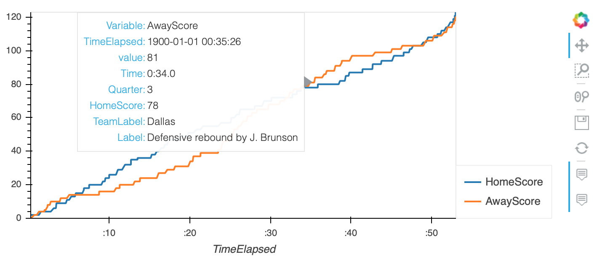

# NBA Match Analysis
## Description
Scrape match information from basketball-reference.com. Extracts the scores and visualises against time.  

Written in python.

<!-- Python webservice designed to run on Google Cloud AppEngine service. -->

## Install
```
python3 -m venv nba_env
source nba_env/bin/activate
python3 -m pip install --upgrade pip
pip install -r src/requirements.txt
```
Optional for debugging/development
```
pip install -r debug/debug_requirements.txt
```

## Usage
<!-- Run `src/main.py` to start the flask webservice.
To trigger:
```
127.0.0.1:8080/morning_alerts
```
All REST end points are defined within `main.py` -->

## App engine update
To update codebase:
```
gcloud app deploy
```
To change cron jobs:
```
gcloud app deploy cron.yaml
```

## Screenshot


# Todo
Add location information from browser to automatically pre-populate the form with local weather information.
