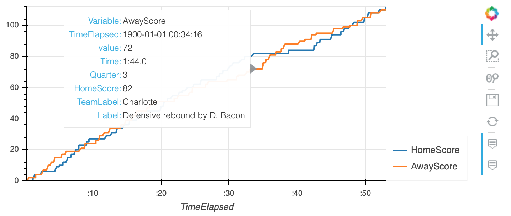

# NBA Match Analysis
## Description
Python webservice designed to run on Google Cloud AppEngine service.  
Scrapes match information from basketball-reference.com. Extracts the scores, pre-processes the data and visualises against time.  

## Install
```
python3 -m venv nba_env
source nba_env/bin/activate
python3 -m pip install --upgrade pip
pip install -r src/requirements.txt
```
Optional for debugging/development
```
pip install -r debug/debug_requirements.txt
```

## Usage
Run `src/main.py` to start the flask webservice.
To trigger call the `nba_score_plot` end point with a game ID from basketball-reference.com e.g.:
```
127.0.0.1:5000/nba_score_plot?game_id=202001080CHO
```

## App engine update
To update codebase:
```
gcloud app deploy
```

## Screenshot


## Example HTML Output
[ExampleMatch.html](ExampleMatch.html)

# Todo
* Change plot
* Create better html file template
* Put live on the cloud
